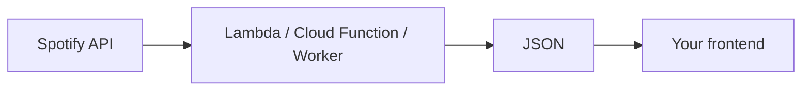

# spotify-now-playing

[](LICENSE)

A Spotify "now playing" backend: one HTTP endpoint returning what's
playing right now, as JSON, computed on every request. Deploy it as an
AWS Lambda, a Yandex Cloud Function, or a Cloudflare Worker.



## Interface

```json
{
  "is_playing": true,
  "track": "Song title",
  "artist": "Artist name, comma-separated if several",
  "url": "https://open.spotify.com/track/..."
}
```

Nothing playing, or Spotify unreachable: `{ "is_playing": false }`.

The response sets `Access-Control-Allow-Origin: *`, so a browser can
`fetch()` it cross-origin. A site with a `Content-Security-Policy`
`connect-src` still has to allow the endpoint's origin (or proxy it
same-origin) — CSP is enforced independently of CORS.

## Setup

1. Create an app at https://developer.spotify.com/dashboard with
   Redirect URI `http://127.0.0.1:8888/callback`; note the Client ID
   and Client Secret.
2. Get a refresh token, once, from any machine with a browser:
   ```bash
   SPOTIFY_CLIENT_ID=xxxx SPOTIFY_CLIENT_SECRET=xxxx python3 get_refresh_token.py
   ```
   Open the printed URL, approve, copy the token it prints.

These three values go into whichever deployment you pick.

## Deployments

| | Runs | Tool |
|---|---|---|
| [AWS Lambda](#aws-lambda) | [`function/now_playing.py`](function/now_playing.py) | `aws` |
| [Yandex Cloud Function](#yandex-cloud-function) | the same file, unmodified | `yc` |
| [Cloudflare Worker](#cloudflare-worker) | [`worker/entry.py`](worker/entry.py) around the same file | `npx wrangler` |

Same code, same output, same trade-off: every poll is a live Spotify
call, so cost and Spotify's rate limit scale with traffic. Pick
whichever account you already have. The Worker can also be routed
under your own Cloudflare-proxied domain, making the endpoint
same-origin with your site — no CORS, no CSP change.

## AWS Lambda

A Lambda with a public function URL, no auth.

<details>
<summary>Walkthrough</summary>

Needs an `aws` CLI configured with a default region and permission to
create IAM roles and Lambda functions.

```bash
export SPOTIFY_CLIENT_ID=xxxx
export SPOTIFY_CLIENT_SECRET=xxxx
export SPOTIFY_REFRESH_TOKEN=xxxx

# One-time: an execution role with CloudWatch Logs only
aws iam create-role \
  --role-name spotify-now-playing-lambda \
  --assume-role-policy-document '{"Version":"2012-10-17","Statement":[{"Effect":"Allow","Principal":{"Service":"lambda.amazonaws.com"},"Action":"sts:AssumeRole"}]}'

aws iam attach-role-policy \
  --role-name spotify-now-playing-lambda \
  --policy-arn arn:aws:iam::aws:policy/service-role/AWSLambdaBasicExecutionRole

ROLE_ARN=$(aws iam get-role --role-name spotify-now-playing-lambda --query Role.Arn --output text)

cd function && zip -r ../function.zip . && cd ..

# A fresh role can take a few seconds to become assumable; retry if this fails on it
aws lambda create-function \
  --function-name spotify-now-playing \
  --runtime python3.12 \
  --handler now_playing.handler \
  --role "$ROLE_ARN" \
  --zip-file fileb://function.zip \
  --timeout 10 \
  --memory-size 128 \
  --environment "Variables={SPOTIFY_CLIENT_ID=$SPOTIFY_CLIENT_ID,SPOTIFY_CLIENT_SECRET=$SPOTIFY_CLIENT_SECRET,SPOTIFY_REFRESH_TOKEN=$SPOTIFY_REFRESH_TOKEN}"

# No --cors-config: the function sets its own CORS headers
aws lambda create-function-url-config \
  --function-name spotify-now-playing \
  --auth-type NONE

# Both permissions are required for a public URL, or it returns 403
aws lambda add-permission \
  --function-name spotify-now-playing \
  --statement-id UrlPolicyInvokeURL \
  --action lambda:InvokeFunctionUrl \
  --principal '*' \
  --function-url-auth-type NONE

aws lambda add-permission \
  --function-name spotify-now-playing \
  --statement-id UrlPolicyInvokeFunction \
  --action lambda:InvokeFunction \
  --principal '*' \
  --invoked-via-function-url

aws lambda get-function-url-config --function-name spotify-now-playing --query FunctionUrl --output text
```

Redeploy after code changes:

```bash
cd function && zip -r ../function.zip . && cd ..
aws lambda update-function-code --function-name spotify-now-playing --zip-file fileb://function.zip
```

Credentials live as the Lambda's environment variables, readable by
anyone with access to the function.

</details>

## Yandex Cloud Function

A Cloud Function with unauthenticated HTTP invoke.

<details>
<summary>Walkthrough</summary>

Needs a `yc` CLI authenticated against your account (`yc init`).

```bash
export SPOTIFY_CLIENT_ID=xxxx
export SPOTIFY_CLIENT_SECRET=xxxx
export SPOTIFY_REFRESH_TOKEN=xxxx

yc serverless function create spotify-now-playing   # skip if it exists

yc serverless function version create \
  --function-name spotify-now-playing \
  --runtime python312 \
  --entrypoint now_playing.handler \
  --memory 128MB \
  --execution-timeout 10s \
  --source-path ./function \
  --environment SPOTIFY_CLIENT_ID=$SPOTIFY_CLIENT_ID,SPOTIFY_CLIENT_SECRET=$SPOTIFY_CLIENT_SECRET,SPOTIFY_REFRESH_TOKEN=$SPOTIFY_REFRESH_TOKEN

yc serverless function allow-unauthenticated-invoke spotify-now-playing

yc serverless function get spotify-now-playing | grep http_invoke_url
```

Redeploy after code changes: re-run `version create`.

Credentials live as the function's environment variables, readable by
anyone with access to the function.

</details>

## Cloudflare Worker

A Python Worker on `*.workers.dev`. [`worker/entry.py`](worker/entry.py)
wraps the shared handler (symlinked in) with a `fetch`-based transport,
since `urllib` can't reach the network under Pyodide.

<details>
<summary>Walkthrough</summary>

Needs Node.js and an API token created with the **Edit Cloudflare
Workers** template at https://dash.cloudflare.com/profile/api-tokens
(or `npx wrangler login` instead).

```bash
export CLOUDFLARE_API_TOKEN=xxxx

cd worker
npx wrangler deploy   # prints https://spotify-now-playing.<your-subdomain>.workers.dev

npx wrangler secret put SPOTIFY_CLIENT_ID       # prompts for the value
npx wrangler secret put SPOTIFY_CLIENT_SECRET
npx wrangler secret put SPOTIFY_REFRESH_TOKEN
```

Redeploy after code changes: re-run `npx wrangler deploy`.

Own domain: in the dashboard, **Workers & Pages** → the Worker →
**Settings** → **Domains & Routes** → **Add** → **Route**, pattern
`your-domain.com/api/now-playing*`. That makes the endpoint
same-origin with your site — no CORS, no CSP change. Add
`"workers_dev": false` to `wrangler.json` to drop the `workers.dev`
URL.

Credentials are stored as encrypted secrets and can't be read back.

</details>
