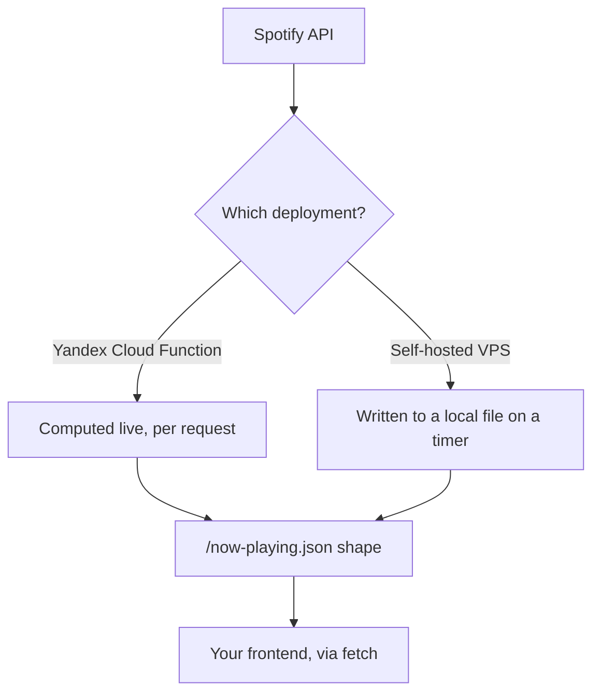

# spotify-now-playing

[](LICENSE)

A Spotify "now playing" widget backend, producing the same small JSON
shape one of two ways: a Yandex Cloud Function that computes it fresh
on every HTTP request, or a VPS that polls Spotify on a schedule and
writes it to a local file. Either way, any frontend, script, app, or
other consumer can fetch it to show what's currently playing.



## Contents

- [Interface](#interface) — the JSON shape both deployments produce
- [Deployment strategies](#deployment-strategies) — Yandex Cloud Function vs. self-hosted VPS, and the trade-off between them
- [Getting started](#getting-started) — one-time Spotify app + refresh token setup, shared by both
- [Choose your deployment](#choose-your-deployment) — jump straight to a walkthrough

## Interface

**Something is playing:**
```json
{
  "is_playing": true,
  "track": "Song title",
  "artist": "Artist name, comma-separated if several",
  "url": "https://open.spotify.com/track/..."
}
```

**Nothing playing, or the widget can't reach Spotify:**
```json
{ "is_playing": false }
```

### Example consumer

[`now-playing-widget.html`](now-playing-widget.html)
is a real, working reference frontend — drop-in markup/CSS/JS to your website. It polls
`/now-playing.json` every 20 seconds with `fetch(url, { cache: 'no-store' })`:

- `is_playing: true` + a `track` → shows a scrolling `"♫ <track> — <artist>"`
  ticker.
- `is_playing: false`, or the fetch/parse fails outright → shows "Not
  listening to anything right now" and pauses the scroll animation
  (the same UI state either way — the file doesn't distinguish "idle"
  from "unreachable," though your own frontend is free to).

Adjust `ENDPOINT` in its `<script>` if you're not serving the JSON
from your site's root, and `POLL_MS` if you want a different polling
interval. Use it as-is, or as a template for your own frontend — the
JSON shape above is all it actually depends on.

## Deployment strategies

Two ways to run this, both producing the same JSON at whatever URL
you point your frontend at:

| | What it is | Freshness | Cost scales with |
|---|---|---|---|
| **Yandex Cloud Function** | `function/now_playing.py`'s `yandex_handler`, computed live on every HTTP request | always current | request volume |
| **Self-hosted VPS** | `infra/vps/spotify_now_playing.py`, writing a local file on a systemd timer | up to one timer interval stale | nothing extra (local disk write) |

Every poll from every visitor to the Yandex Cloud Function triggers a
live Spotify API call, so both Yandex's bill and Spotify's rate limit
scale with actual traffic. The VPS path doesn't have that trade-off
(writing a local file is free regardless of traffic) but its data is
only as fresh as the last scheduled write.

Neither path uses an IaC tool — the Yandex deployment is a short list
of `yc` CLI commands, `infra/vps/` is a plain systemd + nginx setup.
Both are fully supported — pick whichever fits your traffic and cost
tolerance better, or run both.

## Getting started

### 1. Create a Spotify app
- Go to https://developer.spotify.com/dashboard → Create app
- Add Redirect URI: `http://127.0.0.1:8888/callback`
- Copy the **Client ID** and **Client Secret**

### 2. Get a refresh token
```bash
export SPOTIFY_CLIENT_ID=xxxx
export SPOTIFY_CLIENT_SECRET=xxxx
python3 get_refresh_token.py
```
Open the printed URL, approve access, copy the refresh token that gets
printed. Run this once, from anywhere with a browser — it isn't tied
to any of the deployment targets below.

You now have three values (client ID, client secret, refresh token)
that go into whichever deployment option you pick next.

## Choose your deployment

- **[Yandex Cloud Function](#yandex-cloud-function-deployment)** — `yc` CLI, deploys a publicly-invokable Cloud Function, nothing else.
- **[Self-hosted VPS](#self-hosted-vps-deployment)** — systemd timer + nginx, on a server you already run.

## Yandex Cloud Function deployment

Provisions one Cloud Function (running [`function/now_playing.py`](function/now_playing.py)'s
`yandex_handler`) and an IAM binding that makes it publicly invokable
over HTTP with no auth header required. Each request runs the function
fresh, live, right then.

### Prerequisites

- A Spotify client ID, client secret, and refresh token — see
  ["Getting started"](#getting-started) above if you don't have these yet.
- A `yc` CLI already authenticated against your account (`yc init`).

### Deploy

```bash
export SPOTIFY_CLIENT_ID=xxxx
export SPOTIFY_CLIENT_SECRET=xxxx
export SPOTIFY_REFRESH_TOKEN=xxxx

yc serverless function create spotify-now-playing   # skip if it already exists

yc serverless function version create \
  --function-name spotify-now-playing \
  --runtime python312 \
  --entrypoint now_playing.yandex_handler \
  --memory 128MB \
  --execution-timeout 10s \
  --source-path ./function \
  --environment SPOTIFY_CLIENT_ID=$SPOTIFY_CLIENT_ID,SPOTIFY_CLIENT_SECRET=$SPOTIFY_CLIENT_SECRET,SPOTIFY_REFRESH_TOKEN=$SPOTIFY_REFRESH_TOKEN

yc serverless function allow-unauthenticated-invoke spotify-now-playing
```

To redeploy after changing `function/now_playing.py`, just re-run the
`version create` command — it creates a new version and Yandex starts
serving it immediately, no separate "update" step.

Get the invoke URL with `yc serverless function get spotify-now-playing`
(the `http_invoke_url` field) — that URL returns the JSON on every
request. The response sets `Access-Control-Allow-Origin: *`, so a
browser can `fetch()` it directly cross-origin; reverse-proxying it
through nginx for a same-origin path (matching the VPS deployment's
URL shape) also works if you'd rather not expose the
`functions.yandexcloud.net` URL directly.

**If your site sends a `Content-Security-Policy` header with a
`connect-src` directive**, CORS being permissive isn't enough on its
own — CSP is enforced independently by the browser, so `connect-src
'self'` still blocks a `fetch()` to `functions.yandexcloud.net` even
though the function's own CORS headers allow it. Either:
- widen `connect-src` to include the function's origin, narrowly
  (`connect-src 'self' https://functions.yandexcloud.net/<id>` — pinned
  to this one function, breaks if you redeploy under a new ID) or
  broadly (`connect-src 'self' https://functions.yandexcloud.net` —
  survives redeploys, trusts the whole domain instead of one function), or
- reverse-proxy through nginx instead (see above) — same-origin
  sidesteps the CORS and CSP question entirely, since the browser
  never sees the `functions.yandexcloud.net` origin at all.

### Secrets

Spotify credentials are shell env vars passed straight to `yc` on the
command line — nothing writes them to disk as part of this flow. They
do end up stored as the function's environment variables in Yandex
Cloud itself (visible to anyone with read access to the function in
your account), which is inherent to how Cloud Functions pass config
in, not specific to this deploy method.

## Self-hosted VPS deployment

A systemd-timer + VPS implementation, for anyone who'd rather
self-host on a server they already have than use a cloud function. The
commands and paths below use illustrative example values (domain,
paths, user); swap in your own throughout.

### Prerequisites

A Spotify client ID, client secret, and refresh token — see
["Getting started"](#getting-started) above if you don't have these yet.

### 1. Copy files to the VPS
```bash
# Output directory must exist and be writable by www-data *before* the
# service ever runs — create and chown it first.
sudo mkdir -p /var/www/your-domain-name
sudo chown www-data:www-data /var/www/your-domain-name

sudo mkdir -p /opt/spotify-widget
sudo cp infra/vps/spotify_now_playing.py /opt/spotify-widget/

sudo cp infra/vps/spotify-widget.env /etc/spotify-widget.env
sudo nano /etc/spotify-widget.env   # fill in client id/secret/refresh token, and OUTPUT_PATH
sudo chmod 600 /etc/spotify-widget.env
sudo chown root:root /etc/spotify-widget.env

sudo cp infra/vps/spotify-widget.service /etc/systemd/system/
sudo nano /etc/systemd/system/spotify-widget.service   # update ReadWritePaths to match OUTPUT_PATH's directory
sudo cp infra/vps/spotify-widget.timer /etc/systemd/system/
```

### 2. Enable and start the timer
```bash
sudo systemctl daemon-reload
sudo systemctl enable --now spotify-widget.timer

# sanity check it ran
sudo systemctl start spotify-widget.service
cat /var/www/your-domain-name/now-playing.json   # adjust path to your own OUTPUT_PATH
```

### 3. Add a location block to nginx to serve the JSON file

Add this inside your existing HTTPS server block for the domain,
alongside your existing `location /`:

```nginx
location = /now-playing.json {
    alias /var/www/your-domain-name/now-playing.json;
    add_header Cache-Control "no-store";
    default_type application/json;
}
```

Test and reload:
```bash
sudo nginx -t
sudo systemctl reload nginx
```

Then verify:
```bash
curl https://your-domain/now-playing.json
```

### 4. Frontend integration

Once steps 1–3 are done, any frontend polling `/now-playing.json` picks
the widget up automatically — see ["Example consumer"](#example-consumer).