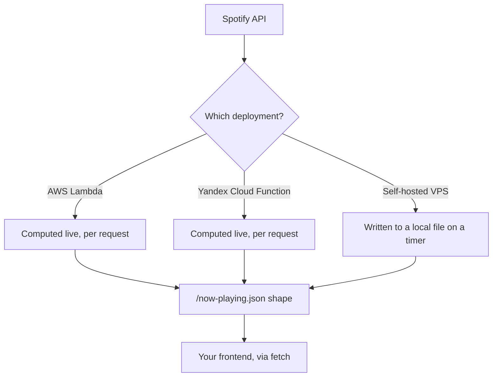

# spotify-now-playing

[](LICENSE)

A Spotify "now playing" widget backend. Deploy as an AWS Lambda or a
Yandex Cloud Function (both compute live per request), or on a VPS
(polls on a schedule, writes a local file) — either way, any frontend
can fetch the same JSON shape to show what's playing.



## Contents

- [Interface](#interface) — the JSON shape all three deployments produce
- [Deployment strategies](#deployment-strategies) — AWS Lambda, Yandex Cloud Function, or self-hosted VPS, and the trade-offs between them
- [Getting started](#getting-started) — one-time Spotify app + refresh token setup, shared by all three
- [Choose your deployment](#choose-your-deployment) — jump straight to a walkthrough

## Interface

**Something is playing:**
```json
{
  "is_playing": true,
  "track": "Song title",
  "artist": "Artist name, comma-separated if several",
  "url": "https://open.spotify.com/track/..."
}
```

**Nothing playing, or the widget can't reach Spotify:**
```json
{ "is_playing": false }
```

### Example consumer

[`now-playing-widget.html`](now-playing-widget.html) is a real,
working reference frontend — drop-in markup/CSS/JS. It polls
`/now-playing.json` every 20 seconds with `fetch(url, { cache: 'no-store' })`:

- `is_playing: true` + a `track` → scrolling `"♫ <track> — <artist>"` ticker.
- Otherwise → "Not listening to anything right now", scroll paused.

Adjust `ENDPOINT` and `POLL_MS` in its `<script>` as needed. Use it
as-is or as a template — the JSON shape above is all it depends on.

## Deployment strategies

Three ways to run this, all producing the same JSON at whatever URL
you point your frontend at:

| | What it is | Freshness | Cost scales with |
|---|---|---|---|
| **AWS Lambda** | `function/now_playing.py`'s `handler`, computed live on every HTTP request | always current | request volume |
| **Yandex Cloud Function** | the same `handler`, unmodified | always current | request volume |
| **Self-hosted VPS** | `infra/vps/spotify_now_playing.py`, writing a local file on a systemd timer | up to one timer interval stale | nothing extra (local disk write) |

The two serverless options are equivalent — the same handler, the same
response shape, the same trade-off; pick whichever cloud account you
already have. Every poll from every visitor triggers a live Spotify
API call, so cost and Spotify's rate limit scale with traffic. The VPS
path is free regardless of traffic, but only as fresh as its last
scheduled write.

None of the three use an IaC tool — AWS and Yandex are short CLI
command lists, VPS is a plain systemd + nginx setup. All fully
supported; pick whichever fits, or run more than one.

## Getting started

### 1. Create a Spotify app
- Go to https://developer.spotify.com/dashboard → Create app
- Add Redirect URI: `http://127.0.0.1:8888/callback`
- Copy the **Client ID** and **Client Secret**

### 2. Get a refresh token
```bash
export SPOTIFY_CLIENT_ID=xxxx
export SPOTIFY_CLIENT_SECRET=xxxx
python3 get_refresh_token.py
```
Open the printed URL, approve access, copy the refresh token that gets
printed. Run this once, from anywhere with a browser — it isn't tied
to any of the deployment targets below.

You now have three values (client ID, client secret, refresh token)
that go into whichever deployment option you pick next.

## Choose your deployment

- **[AWS Lambda](#aws-lambda-deployment)** — `aws` CLI, deploys a Lambda with a public function URL.
- **[Yandex Cloud Function](#yandex-cloud-function-deployment)** — `yc` CLI, deploys a publicly-invokable Cloud Function, nothing else.
- **[Self-hosted VPS](#self-hosted-vps-deployment)** — systemd timer + nginx, on a server you already run.

## AWS Lambda deployment

Provisions one Lambda ([`function/now_playing.py`](function/now_playing.py)'s
`handler`) with a public function URL — no auth header required. Each
request runs it fresh, live.

### Prerequisites

- A Spotify client ID, client secret, and refresh token — see
  ["Getting started"](#getting-started) above if you don't have these yet.
- An `aws` CLI already configured with a default region (`aws configure`),
  with permission to create IAM roles and Lambda functions.

### Deploy

```bash
export SPOTIFY_CLIENT_ID=xxxx
export SPOTIFY_CLIENT_SECRET=xxxx
export SPOTIFY_REFRESH_TOKEN=xxxx

# One-time: an execution role, granting the function CloudWatch Logs only
aws iam create-role \
  --role-name spotify-now-playing-lambda \
  --assume-role-policy-document '{"Version":"2012-10-17","Statement":[{"Effect":"Allow","Principal":{"Service":"lambda.amazonaws.com"},"Action":"sts:AssumeRole"}]}'

aws iam attach-role-policy \
  --role-name spotify-now-playing-lambda \
  --policy-arn arn:aws:iam::aws:policy/service-role/AWSLambdaBasicExecutionRole

ROLE_ARN=$(aws iam get-role --role-name spotify-now-playing-lambda --query Role.Arn --output text)

cd function && zip -r ../function.zip . && cd ..

aws lambda create-function \
  --function-name spotify-now-playing \
  --runtime python3.12 \
  --handler now_playing.handler \
  --role "$ROLE_ARN" \
  --zip-file fileb://function.zip \
  --timeout 10 \
  --memory-size 128 \
  --environment "Variables={SPOTIFY_CLIENT_ID=$SPOTIFY_CLIENT_ID,SPOTIFY_CLIENT_SECRET=$SPOTIFY_CLIENT_SECRET,SPOTIFY_REFRESH_TOKEN=$SPOTIFY_REFRESH_TOKEN}"

# Public HTTP endpoint. No --cors-config here on purpose: the function
# sets its own CORS headers, and AWS would return a duplicate set.
aws lambda create-function-url-config \
  --function-name spotify-now-playing \
  --auth-type NONE

# Both statements are required — since October 2025 a public function
# URL needs InvokeFunctionUrl *and* InvokeFunction, or it returns 403.
aws lambda add-permission \
  --function-name spotify-now-playing \
  --statement-id UrlPolicyInvokeURL \
  --action lambda:InvokeFunctionUrl \
  --principal '*' \
  --function-url-auth-type NONE

aws lambda add-permission \
  --function-name spotify-now-playing \
  --statement-id UrlPolicyInvokeFunction \
  --action lambda:InvokeFunction \
  --principal '*' \
  --invoked-via-function-url
```

A freshly created IAM role takes a few seconds to become assumable —
if `create-function` fails with "role cannot be assumed by Lambda",
wait and re-run it.

To redeploy after code changes, re-zip and update:

```bash
cd function && zip -r ../function.zip . && cd ..
aws lambda update-function-code \
  --function-name spotify-now-playing \
  --zip-file fileb://function.zip
```

Get the invoke URL with
`aws lambda get-function-url-config --function-name spotify-now-playing --query FunctionUrl --output text`
— a `https://<url-id>.lambda-url.<region>.on.aws` URL returning the
JSON on every request. The response sets
`Access-Control-Allow-Origin: *` for direct cross-origin `fetch()`;
reverse-proxy it through nginx instead if you'd rather keep a
same-origin path.

**Note:** a site with its own `Content-Security-Policy` `connect-src`
directive blocks this fetch regardless of CORS — CSP and CORS are
enforced independently by the browser. Either add your
`https://<url-id>.lambda-url.<region>.on.aws` origin to `connect-src`,
or use the nginx reverse-proxy above to stay same-origin instead.

### Secrets

Spotify credentials are shell env vars passed to `aws` directly —
nothing written to disk by this flow. They do end up as the Lambda's
environment variables in AWS itself, readable by anyone with access to
the function in your account.

## Yandex Cloud Function deployment

Provisions one Cloud Function ([`function/now_playing.py`](function/now_playing.py)'s
`handler`), made publicly invokable over HTTP with no auth
header. Each request runs it fresh, live.

### Prerequisites

- A Spotify client ID, client secret, and refresh token — see
  ["Getting started"](#getting-started) above if you don't have these yet.
- A `yc` CLI already authenticated against your account (`yc init`).

### Deploy

```bash
export SPOTIFY_CLIENT_ID=xxxx
export SPOTIFY_CLIENT_SECRET=xxxx
export SPOTIFY_REFRESH_TOKEN=xxxx

yc serverless function create spotify-now-playing   # skip if it already exists

yc serverless function version create \
  --function-name spotify-now-playing \
  --runtime python312 \
  --entrypoint now_playing.handler \
  --memory 128MB \
  --execution-timeout 10s \
  --source-path ./function \
  --environment SPOTIFY_CLIENT_ID=$SPOTIFY_CLIENT_ID,SPOTIFY_CLIENT_SECRET=$SPOTIFY_CLIENT_SECRET,SPOTIFY_REFRESH_TOKEN=$SPOTIFY_REFRESH_TOKEN

yc serverless function allow-unauthenticated-invoke spotify-now-playing
```

To redeploy after code changes, just re-run `version create` — new
version, served immediately, no separate "update" step.

Get the invoke URL from `yc serverless function get spotify-now-playing`
(`http_invoke_url` field). The response sets
`Access-Control-Allow-Origin: *` for direct cross-origin `fetch()`;
reverse-proxy it through nginx instead if you'd rather keep a
same-origin path.

**Note:** a site with its own `Content-Security-Policy` `connect-src`
directive blocks this fetch regardless of CORS — CSP and CORS are
enforced independently by the browser. Either add
`https://functions.yandexcloud.net` to `connect-src`, or use the
nginx reverse-proxy above to stay same-origin instead.

### Secrets

Spotify credentials are shell env vars passed to `yc` directly —
nothing written to disk by this flow. They do end up as the
function's environment variables in Yandex Cloud itself, readable by
anyone with access to the function in your account.

## Self-hosted VPS deployment

A systemd-timer + VPS implementation, for self-hosting instead of a
cloud function. Commands below use example values (domain, paths,
user) — swap in your own throughout.

### Prerequisites

A Spotify client ID, client secret, and refresh token — see
["Getting started"](#getting-started) above if you don't have these yet.

### 1. Copy files to the VPS
```bash
# Create and chown the output dir before starting the service —
# it must exist and be www-data-writable first.
sudo mkdir -p /var/www/your-domain-name
sudo chown www-data:www-data /var/www/your-domain-name

sudo mkdir -p /opt/spotify-widget
sudo cp infra/vps/spotify_now_playing.py /opt/spotify-widget/

sudo cp infra/vps/spotify-widget.env /etc/spotify-widget.env
sudo nano /etc/spotify-widget.env   # fill in client id/secret/refresh token, and OUTPUT_PATH
sudo chmod 600 /etc/spotify-widget.env
sudo chown root:root /etc/spotify-widget.env

sudo cp infra/vps/spotify-widget.service /etc/systemd/system/
sudo nano /etc/systemd/system/spotify-widget.service   # update ReadWritePaths to match OUTPUT_PATH's directory
sudo cp infra/vps/spotify-widget.timer /etc/systemd/system/
```

### 2. Enable and start the timer
```bash
sudo systemctl daemon-reload
sudo systemctl enable --now spotify-widget.timer

# sanity check it ran
sudo systemctl start spotify-widget.service
cat /var/www/your-domain-name/now-playing.json   # adjust path to your own OUTPUT_PATH
```

### 3. Add a location block to nginx to serve the JSON file

Add this inside your existing HTTPS server block for the domain,
alongside your existing `location /`:

```nginx
location = /now-playing.json {
    alias /var/www/your-domain-name/now-playing.json;
    add_header Cache-Control "no-store";
    default_type application/json;
}
```

Test and reload:
```bash
sudo nginx -t
sudo systemctl reload nginx
```

Then verify:
```bash
curl https://your-domain/now-playing.json
```

### 4. Frontend integration

Once steps 1–3 are done, any frontend polling `/now-playing.json` picks
the widget up automatically — see ["Example consumer"](#example-consumer).
